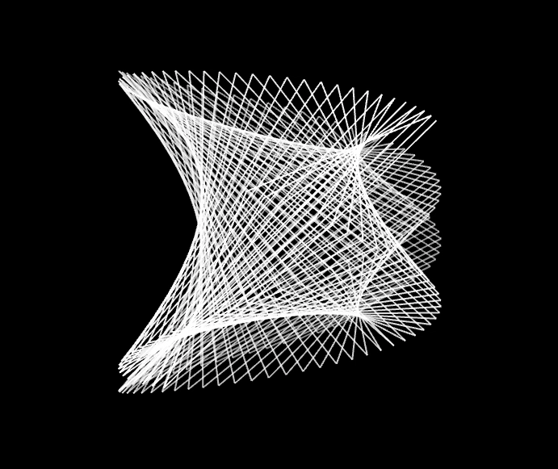
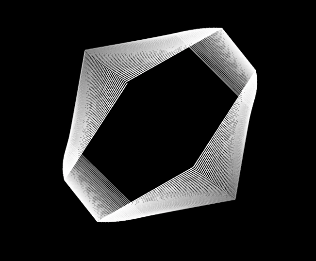
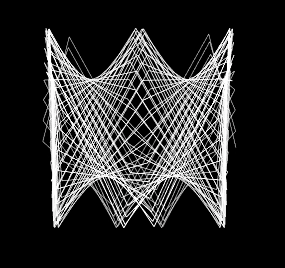

# Lissajous
Openframeworks app for creating and controlling Lissajous figures using arrow keys

Pre built on Mac OSX 10.13:

In terminal run "open bin/Lissjous.app"

Otherwise:
To build please run "make"

